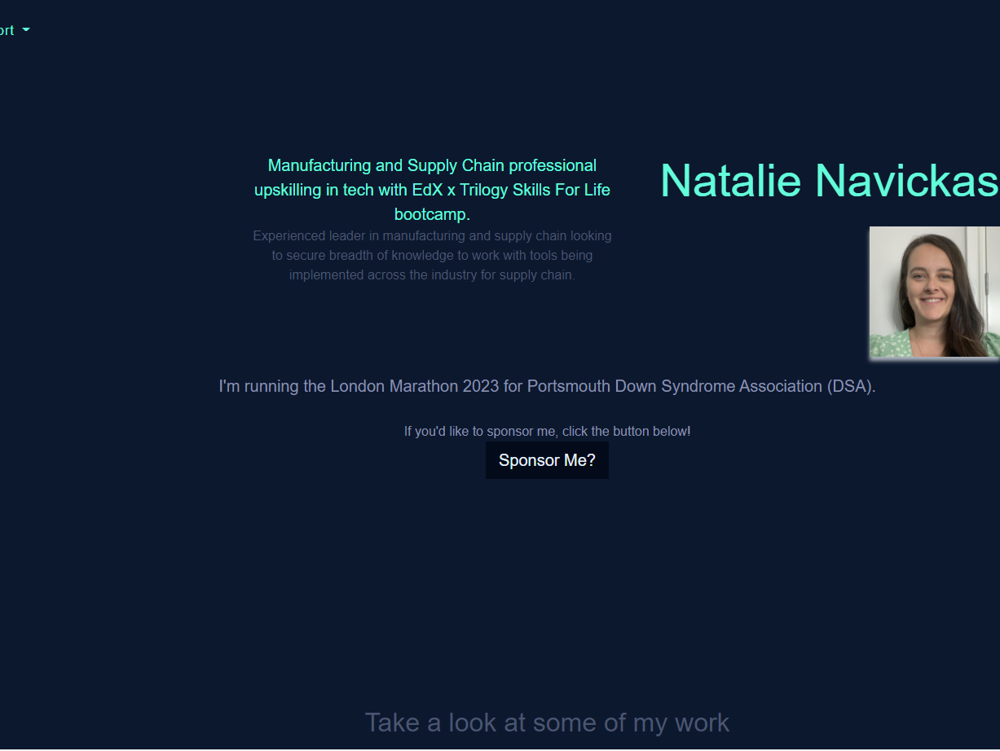

# Bootstrap Portfolio

An updated version of the student portfolio created in week 2. This week the project utilises bootstrap tools to enable easier design and execution.

### Project Criteria

**Grading Requirements**

This homework was created based on the following criteria:

**Technical Acceptance Criteria: 40%**

✔️Meets described tasks and actions in project README.

**Deployment: 32%**

✔️Application deployed at live URL.

✔️Application loads with no errors.

✔️Application GitHub URL submitted.

✔️GitHub repository contains application code.

**Application Quality: 15%**

✔️Application resembles the functionality of their previous portfolio.

**Repository Quality: 12%**

✔️Repository has a unique name.

✔️Repository follows best practices for file structure and naming conventions.

✔️Repository follows best practices for class/id naming conventions, indentation, quality comments, etc.

✔️Repository contains multiple descriptive commit messages.

✔️Repository contains quality readme with description, screenshot, link to deployed application https://nnavickas.github.io/Bootstrap-Portfolio/.

**Review**

Submitted:

✔️The URL of the deployed application.

✔️The URL of the GitHub repository that contains your code. Give the repository a unique name and include a README file that describes the project.

## Deployment

Deployed using GitHub Pages.

## Built With

* [BootStrap](https://getbootstrap.com/docs/4.4/) 

## Authors

* **Natalie Navickas** - *Initial work* - [NNavickas](https://github.com/NNavickas)

## License

N/A

## Acknowledgments

* Big thanks to Trilogy Skills For Life x EdX
